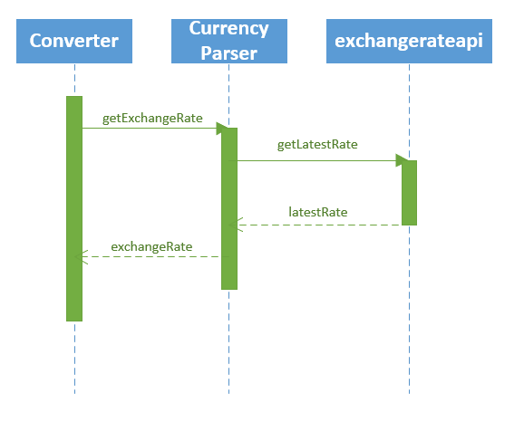
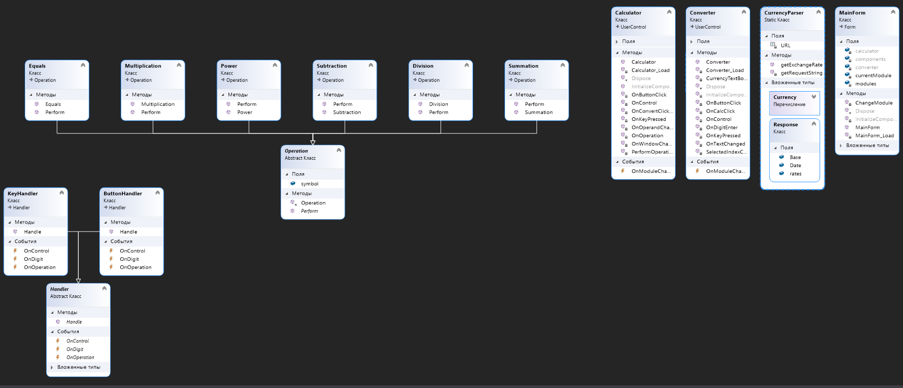
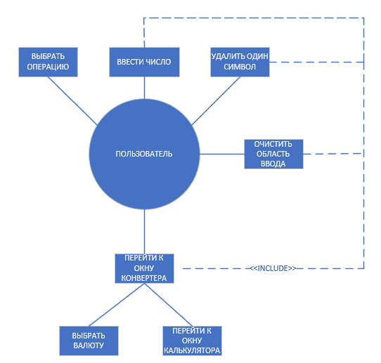
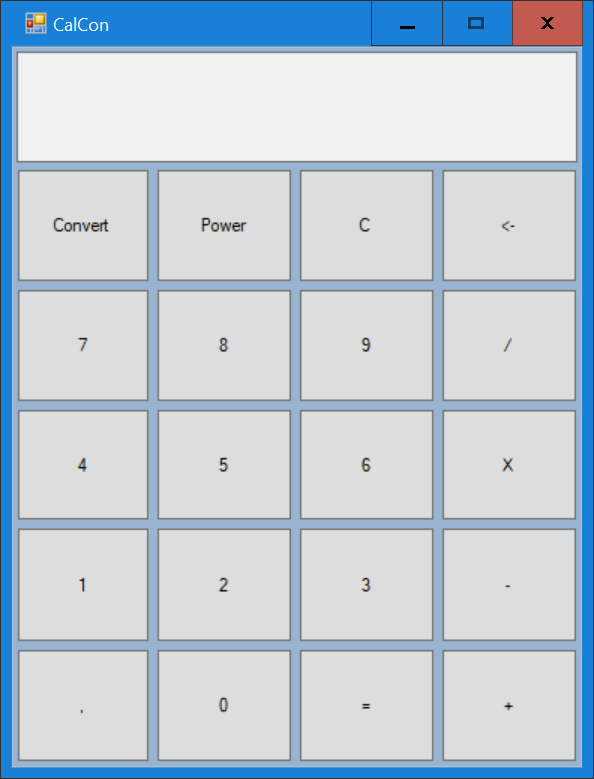
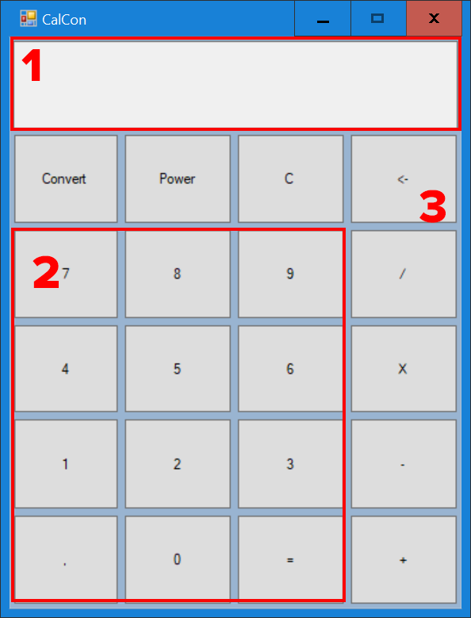
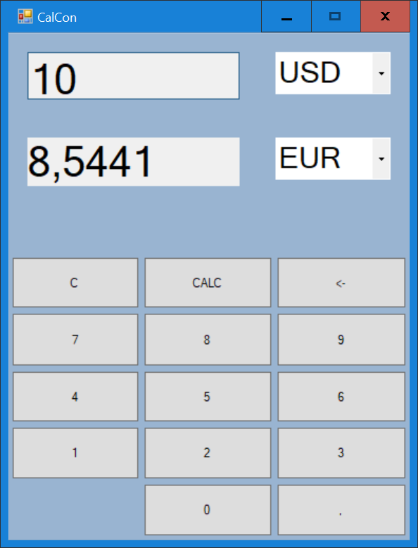
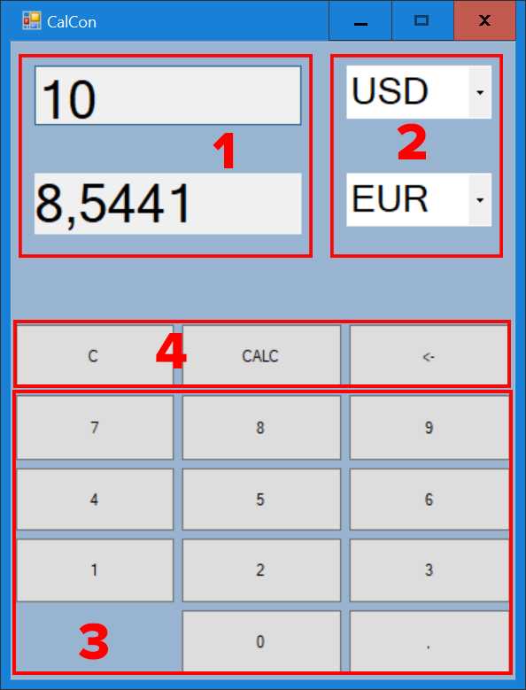

# Спецификации разработки ПО

## 1 Введение
### 1.1 Цель
Данный документ содержит детали реализации требований к проекту «CalCon».

### 1.2 Обзор системы
Данный продукт представляет собой калькулятор в функцией конвертации валют, позволяющий выполнять простейшие арифметические операции и конвертировать суммы из одной валюты в другую в режиме реального времени по наиболее актуальным курсам. Пользовательский интерфейс должен быть интуитивным и дружелюбным. Переход между окнами калькулятора и конвертера производится в одно нажатие.

### 1.3 Карта документа
В данном документе содержатся информациях об основных решениях, которые будут использоваться при разработке проекта. В разделе 3 содержится информация о структуре проекта и взаимосвязи классов в нём, а также описан протокол взаимодействия с API сервиса exchangeratesapi.io, формат запроса и ответа сервиса.

### 1.4 Термины и сокращения
Конвертация валюты - обмена денежных единиц одного государства на денежные единицы другого.

Конвертер валют (конвертер) - алгоритм, выполняющий конвертацию валюты.

JSON (англ. JavaScript Object Notation) — текстовый формат обмена данными

## 2 Обзор системы
### 2.1 Допущения
Допущения, в сильной мере влияющие на разработку, отсутствуют

### 2.2 Ограничения
Спектр валют для конвертации ограничен списком курсов Европейского Центрального банка. Также работоспособность конвертера напрямую зависит от состояния сервиса exchangeratesapi.io

### 2.3 Системная среда
Создаваемый программный продукт будет работать в операционной системе Windows 10.

### 2.4 Методология разработки
Для создания данного программного продукта была выбрана объектно-ориентированная методология разработки ПО.

Для взаимодействия с сервисом exchangeratesapi.io используются HTTP GET запросы

### 2.5 Риски и опасные места
Конвертер валют перестаёт работать при сбоях со стороны сервиса exchangeratesapi.io

## 3 Архитектура
### 3.1 Обзор
Особенности архитектуры создаваемого приложения обусловлены объектно-ориентированной парадигмой разработки, а также тем, что данное приложение является сетевым.

### 3.2 Протокол получения курса валют
Для получения курсов валют Европейского Центрального банка используется API сервиса exchangeratesapi.io

Формат запроса для получения актуальнейшего курса на данный момент выглядит следующим образом:
```
    GET https://api.exchangeratesapi.io/latest HTTP/1.1
```
В таком случае будет получен следующий ответ в формате JSON:
```JSON
{
  "base": "EUR",
  "date": "2020-10-10",
  "rates": {
    "CAD": 1.565,
    "CHF": 1.1798,
    "GBP": 0.87295,
    "SEK": 10.2983,
    "EUR": 1.092,
    "USD": 1.2234,
    ...
  }
}
```


Рассмотрим различные параметры для этого запроса (табл. 1)

<table>
    <tr>
        <td>
        <td><b>base
        <td><b>symbols
    </tr>
    <tr>
        <td><b>Описание
        <td>Используется для специфицирования базовой валюты
        <td>Используется для фильтрации возвращаемых курсов
    </tr>
    <tr>
        <td><b>Пример запроса
        <td><code>GET https://api.exchangeratesapi.io/latest?base=USD HTTP/1.1
        <td><code>GET https://api.exchangeratesapi.io/latest?base=USD&symbols=EUR HTTP/1.1
    </tr>
</table>


Ответ на запрос с параметром **base**:
```JSON
{
  "base": "USD",
  "date": "2020-10-10",
  "rates": {
    "CAD": 1.565,
    "CHF": 1.1798,
    "GBP": 0.87295,
    "SEK": 10.2983,
    "EUR": 0.852,
    "USD": 1,
    ...
  }
}
```

Ответ на запрос с параметром **symbols**:
```JSON
{
  "base": "USD",
  "date": "2020-10-10",
  "rates": {
    "EUR": 0.8527330093
  }
}
```

Диаграмма последовательности, отражающая взаимодействие с exchangerateapi.io класса CurrencyParser, представлена на рисунке 1

<p align="center">

<p align="center"> Рисунок 1 - Диаграмма последовательности получения курса валют

### 3.3 Классы
В соответствии с парадигмой объектно-ориентированного программирования за каждую важную деталь создаваемой игры отвечает отдельный класс. К основным классам можно отнести:


- _MainForm_ – отвечает за выбор и отображение текущего модуля;
- _Calculator_ – отвечает за отображение элементов интерфейса калькулятора, их взаимодействие, инициацию арифметических операций и вывод результа их выполнения;
 - _Converter_ – отвечает за отображение элементов интерфейса конвертера валют, их взаимодействие и вывод результатов конвертации;
- _CurrencyParser_ – отвечает за получение актуальных курсов валют используя GET запросы;
- _ButtonHandler_ – отвечает за обработку нажатия кнопок конвертера и калькулятора, а также активизирует соответствующие события;
- _KeyHandler_ – отвечает за обработку ввода с клавиатуры, а также активизирует соответствующие события;
- _Handler_ – является базовым для двух предыдущих классов;
- _Operation_ – является базовым классом для всех арифметических операций;
- _Summation_, _Subtraction_, _Multiplication_, _Division_, _Power_  – классы арифметических операций, выполняющие соответствующие операции;

Диаграмма классов представлена на рисунке 2

<p align="center">

<p align="center"> Рисунок 2 - Диаграмма классов

### 3.4 Диаграмма вариантов использования и интерфейс пользователя
На рисунке 3 изображена диаграмма вариантов использования

<p align="center"> 
<p align = "center">Рисунок 3 – Диаграмма вариантов использования калькулятора "CalCon"

Создаваемый программный продукт будет иметь классический графический пользовательский интерфейс, выполненный в стилистике Flat design, примером которой может служить интерфейс Windows 10.

Сразу после запуска приложения появляется окно калькулятора (рисунок 4)
<p align="center">
<p align = "center">Рисунок 4 - Окно калькулятора

Данное окно можно условно разделить на 3 части:
* Область вывода (Рисунок 5, область 1)
* Область ввода 
  *  Кнопки для ввода числа (Рисунок 5, область 2)
  *  Кнопки управления и операций (Рисунок 5, область 3)


<p align="center"> 
<p align = "center">Рисунок 5 - Области окна калькулятора</p>

При нажатии на кнопку "Convert" окно калькулятора сменяется окном конвертера
<p align="center">
<p align = "center">Рисунок 6 - Окно конвертера</p>

Конвертер можно разделить на 2 области, которые, в свою очередь, можно разделить ещё на 4:
* Область вывода
   * Область вывода суммы (Рисунок 7, область 1)
   * Область выбора валюты (Рисунок 7, область 2)
* Область ввода
   * Кнопки для ввода суммы (Рисунок 5, область 3)
   * Кнопки управления (Рисунок 5, область 4)

<p align="center"> 
<p align = "center">Рисунок 5 - Области окна конвертера</p>