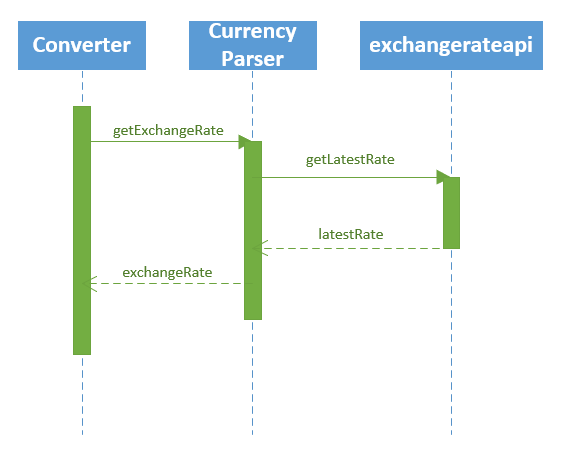
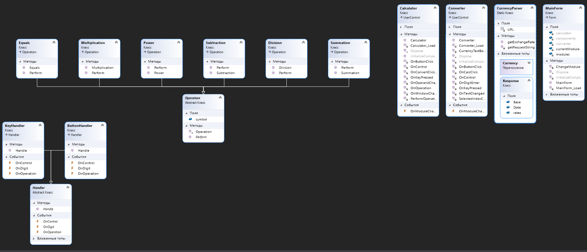
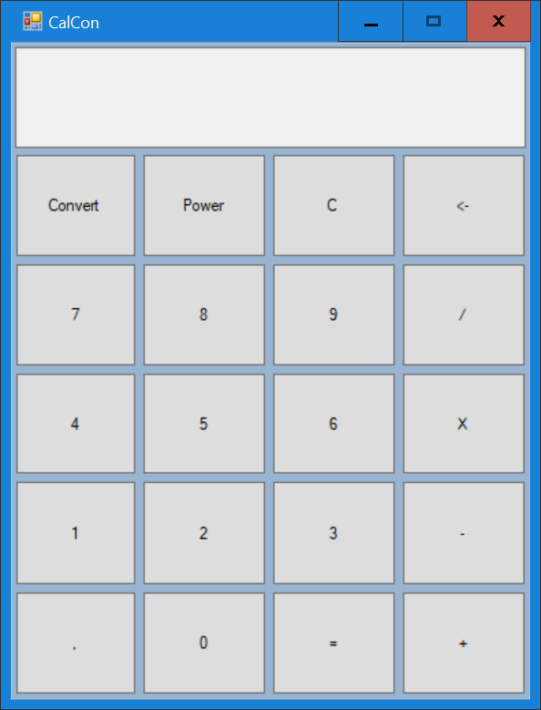
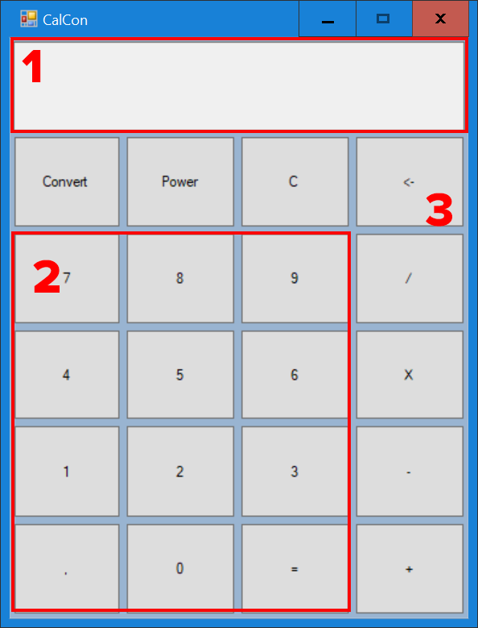
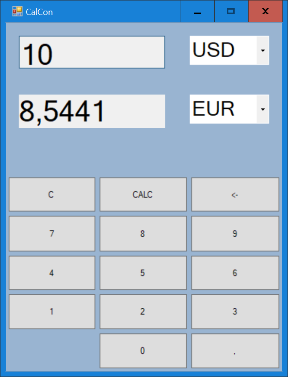
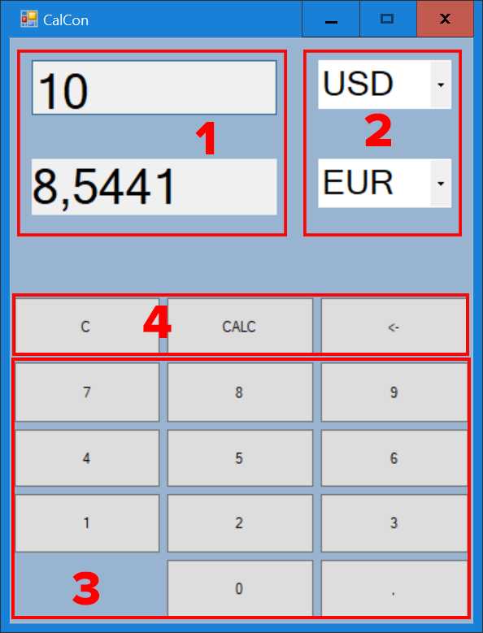

<h1>Спецификации разработки ПО</h1>
<h2>1 Введение</h2>
<h3>1.1 Цель</h3>

Данный документ содержит детали реализации требований к проекту «CalCon».

<h3>1.2 Обзор системы</h3>

Данный продукт представляет собой калькулятор в функцией конвертации валют. Он позволяет выполнять простейшие арифметические операции и конвертировать суммы из одной валюты в другую в режиме реального времени по наиболее актуальным курсам. Реализован удобный и понятный пользовательский интерфейс. Переход между окнами калькулятора и конвертера производится в одно нажатие.

<h3>1.3 Карта документа</h3>

В данном документе содержатся информациях об основных решениях, которые будут использоваться при разработке проекта. В разделе 3 содержится информация о структуре проекта и взаимосвязи классов в нём, а также описан протокол взаимодействия с API сервиса exchangeratesapi.io, формат запроса и ответа сервиса.

<h3>1.4 Термины и сокращения</h3>

Конвертация валюты - обмена денежных единиц одного государства на денежные единицы другого.

 Конвертер валют (конвертер) - алгоритм, выполняющий конвертацию валюты.
<h2>2 Обзор системы</h2>
<h3>2.1 Допущения</h3>

В ходе разработки серьёзных допущений не было.

<h3>2.2 Ограничения</h3>

Спектр валют для конвертации ограничен списком курсов Европейского Центрального банка. Также работоспособность конвертера напрямую зависит от состояния сервиса exchangeratesapi.io

<h3>2.3 Системная среда</h3>

Создаваемый программный продукт будет работать в операционной системе Windows 10.

<h3>2.4 Методология разработки</h3>

Для создания данного программного продукта была выбрана объектно-ориентированная методология разработки ПО.

Для взаимодействия с сервисом https://exchangeratesapi.io используются HTTP GET запросы

<h3>2.5 Риски и опасные места</h3>

Конвертер валют перестаёт работать при сбоях со стороны сервиса https://exchangeratesapi.io/

<h2>3 Архитектура</h2>
<h3>3.1 Обзор</h3>

Особенности архитектуры создаваемого приложения обусловлены объектно-ориентированной парадигмой разработки, а также тем, что данное приложение является сетевым.

<h3>3.2 Протокол получения курса валют</h3>

Для получения курсов валют Европейского Центрального банка используется API сервиса https://exchangeratesapi.io/

Формат запроса для получения актуальнейшего курса на данный момент выглядит следующим образом:

    GET https://api.exchangeratesapi.io/latest

В таком случае будет получен следующий ответ в формате JSON:

{
"base": "EUR",

  "date": "2020-10-10",
  
"rates": {
        
"CAD": 1.565,
        
"CHF": 1.1798,
        
"GBP": 0.87295,
        
"SEK": 10.2983,
        
"EUR": 1.092,
        
"USD": 1.2234,
        
...
  
}
}

Как можно заметить, базовой валютой по умолчанию является Евро. Для того, чтобы специфицировать базовую валюту необходимо модифицировать запрос. Допустим, мы хотим получить курсы относительно доллара США. Тогда запрос будет выглядеть следующим образом:

    GET https://api.exchangeratesapi.io/latest?base=USD

Ответ на такой запрос будет выглядеть так:

{
  
"base": "USD",
  
"date": "2020-10-10",
  
"rates": {
  
  "CAD": 1.565,
  
  "CHF": 1.1798,
  
  "GBP": 0.87295,
  
  "SEK": 10.2983,
  
  "EUR": 0.852,
  
  "USD": 1,
  
  ...
  
}
}

Предположим, мы хотим конвертировать 10 USD в EUR. Используя предыдущий запрос кроме курса евро мы получим также все остальные. Эта информация избыточна и может замедлить работу программы. Для того, чтобы получить определённый курс изменим запрос:

    GET https://api.exchangeratesapi.io/latest?base=USD&symbols=EUR

Ответом на такой запросу является следующий JSON:

{
  "base": "USD",
  
"date": "2020-10-10",
  
"rates": {
    
"EUR": 0.8527330093
  
}
}

Теперь мы можем извлечь данный курс любым удобным способом работы с JSON (в моём случае был использован модуль Newtonsoft.Json, осуществляющий сериализацию и десериализацию объектов в(из) формат(а) JSON) и, домножив его на 10 получим, что 10$ USD = 8.527 EUR

Диаграмма последовательности, отражающая взаимодействие с exchangerateapi.io класса CurrencyParser, представлена на рисунке 1

 Рисунок 1 - Диаграмма последовательности получения курса валют
<h3>3.3 Классы</h3>

В соответствии с парадигмой объектно-ориентированного программирования за каждую важную деталь создаваемой игры отвечает отдельный класс. К основным классам можно отнести:

<ul>
 <li>
MainForm – отвечает за выбор и отображение текущего модуля;
</li>
 <li>
Calculator – отвечает за отображение элементов интерфейса калькулятора, их взаимодействие, инициацию арифметических операций и вывод результа их выполнения;
</li>
 <li>
Converter – отвечает за отображение элементов интерфейса конвертера валют, их взаимодействие и вывод результатов конвертации;
</li>
 <li>
CurrencyParser – отвечает за получение актуальных курсов валют используя GET запросы;
</li>
 <li>
ButtonHandler – отвечает за обработку нажатия кнопок конвертера и калькулятора, а также активизирует соответствующие события;
</li>
 <li>
KeyHandler – отвечает за обработку ввода с клавиатуры, а также активизирует соответствующие события;
</li>
 <li>
Handler – является базовым для двух предыдущих классов;
</li>
 <li>
Operation – является базовым классом для всех арифметических операций;
</li>
 <li>
Summation, Subtraction, Multiplication, Division, Power  – классы арифметических операций, выполняющие соответствующие операции;
</li>
</ul>

 Диаграмма классов представлена на рисунке 2

 Рисунок 2 - Диаграмма классов

<h3>3.4 Диаграмма вариантов использования и интерфейс пользователя</h3>

На рисунке 3 изображена диаграмма вариантов использования

 

Рисунок 3 – Диаграмма вариантов использования калькулятора "CalCon"</h2> 

Создаваемый программный продукт будет иметь классический графический пользовательский интерфейс, выполненный в стилистике Flat design, примером которой может служить интерфейс Windows 10.

 Сразу после запуска приложения появляется окно калькулятора (рисунок 4)

Рисунок 4 - Окно калькулятора

 Данное окно можно условно разделить на 3 части:
<ul>
    <li>Область вывода (Рисунок 5, область 1)
    <li>Область ввода 
        <ul>
            <li> Кнопки для ввода числа (Рисунок 5, область 2)
            <li> Кнопки управления и операций (Рисунок 5, область 3)
        </ul>
    </li>
</ul>

 

Рисунок 5 - Области окна калькулятора

При нажатии на кнопку "Convert" окно калькулятора сменяется окном конвертера

Рисунок 6 - Окно конвертера

Конвертер можно разделить на 2 области, которые, в свою очередь, можно разделить ещё на 4:
<ul>
    <li>Область вывода
            <ul>
            <li> Область вывода суммы (Рисунок 7, область 1)
            <li> Область выбора валюты (Рисунок 7, область 2)
        </ul>
    <li>Область ввода
        <ul>
            <li> Кнопки для ввода суммы (Рисунок 5, область 3)
            <li> Кнопки управления (Рисунок 5, область 4)
        </ul>
</ul>

 

Рисунок 5 - Области окна конвертера
